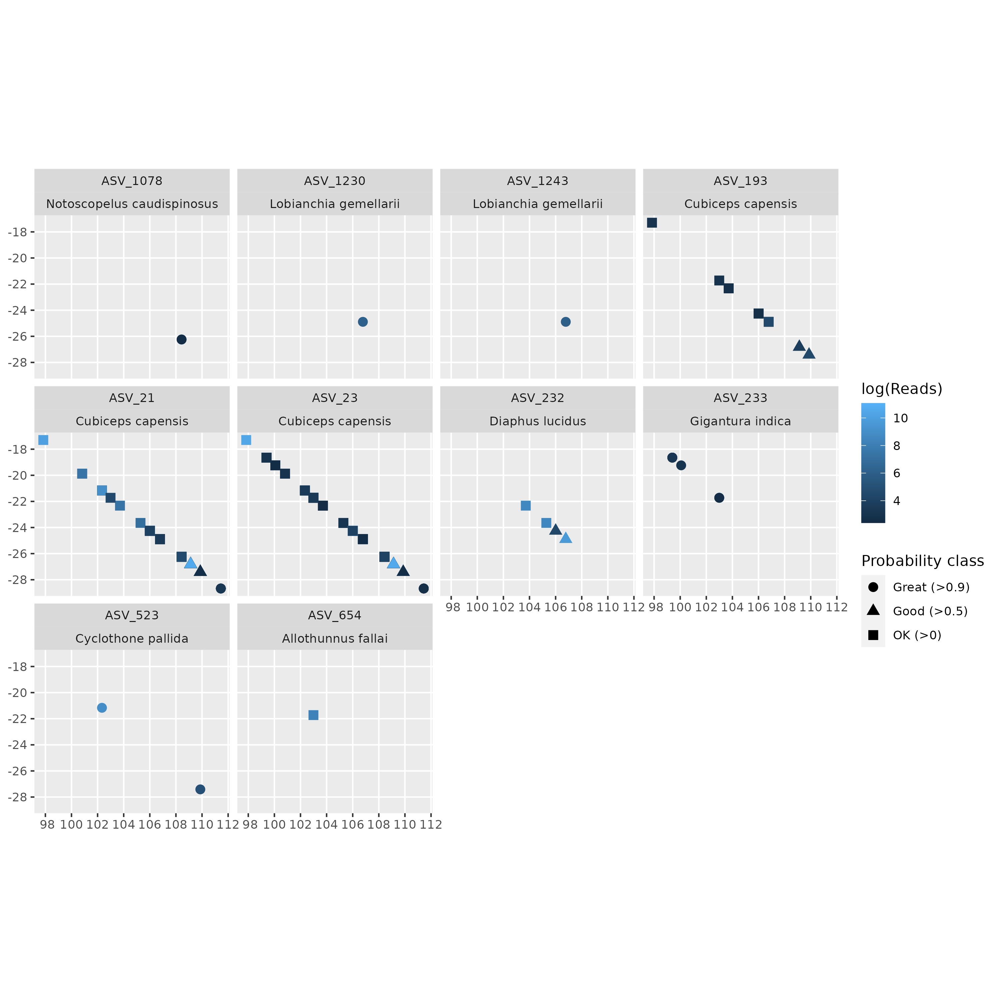

# OcOm CompareAquamaps

This package contains two functions:

- get_shapes() - given a OceanOmics amplicon pipeline phyloseq object RDS file, 
                pull out the Aquamaps species probability maps for the sighted species,
                then returns a table with the ASV-based species sightings, their latitude/longitude,
                and their Aquamaps probabilities for that location
- plot_shapes() - a helper function to plot the probabilities. Looks like this:

# Installation

It *should* be possible to install via remotes::install_github(). HOWEVER, we depend on aquamapsdata, and that package is currently not easy to install as rcrypt has been removed from CRAN. Here's a workaround using `remotes`:

    install.packages('remotes')
    remotes::install_github('cran/rcrypt', dependencies = TRUE)
    remotes::install_github('raquamaps/aquamapsdata', dependencies = TRUE)
    remotes::install_github('philippbayer/OcOmCompareAquamaps, dependencies = TRUE)
    
    
# Usage

    shp <- get_shapes('some_file.RDS')

Then do whatever you want with the resulting data.

The data looks like this:

|ASV     |species                  |Location           | Reads| latitude_dd| longitude_dd|SpeciesID |CsquareCode | NLimit| Slimit| WLimit| ELimit| Probability|Probability_class |
|:-------|:------------------------|:------------------|-----:|-----------:|------------:|:---------|:-----------|------:|------:|------:|------:|-----------:|:-----------------|
|ASV_93  |Ranzania laevis          |V10_CKI_N_H_5_12_2 | 23004|   -19.23755|    100.07472|Fis-23758 |3110:390:1  |  -19.0|  -19.5|    100|  100.5|           1|Great (>0.9)      |
|ASV_968 |Bolinichthys photothorax |V10_CKI_U_13_1     |   216|   -18.64562|     99.39633|Fis-28239 |3109:489:3  |  -18.5|  -19.0|     99|   99.5|           1|Great (>0.9)      |
|ASV_968 |Bolinichthys photothorax |V10_CKI_U_13_2     |   388|   -18.64562|     99.39633|Fis-28239 |3109:489:3  |  -18.5|  -19.0|     99|   99.5|           1|Great (>0.9)      |
|ASV_968 |Bolinichthys photothorax |V10_CKI_U_13_3     |   193|   -18.64562|     99.39633|Fis-28239 |3109:489:3  |  -18.5|  -19.0|     99|   99.5|           1|Great (>0.9)      |
|ASV_968 |Bolinichthys photothorax |V10_CKI_U_13_4     |    81|   -18.64562|     99.39633|Fis-28239 |3109:489:3  |  -18.5|  -19.0|     99|   99.5|           1|Great (>0.9)      |
|ASV_968 |Bolinichthys photothorax |V10_CKI_U_13_5     |   161|   -18.64562|     99.39633|Fis-28239 |3109:489:3  |  -18.5|  -19.0|     99|   99.5|           1|Great (>0.9)      |

